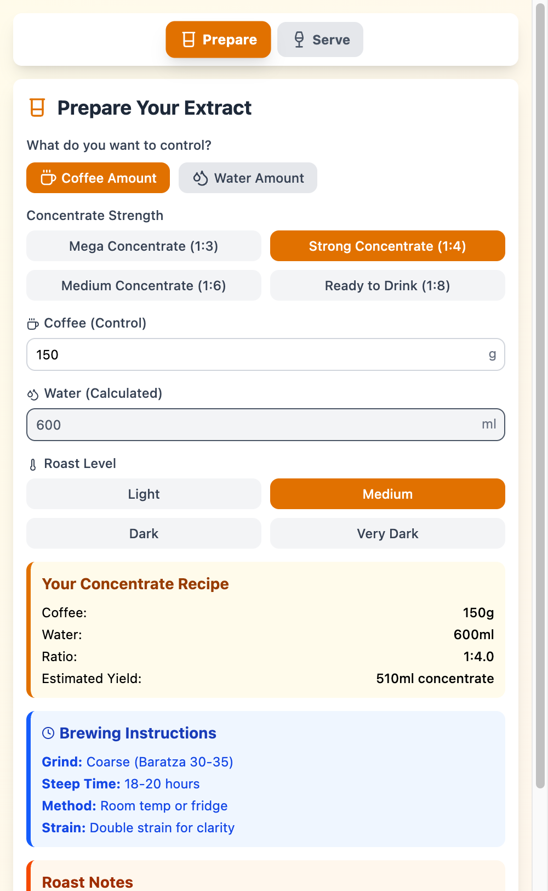
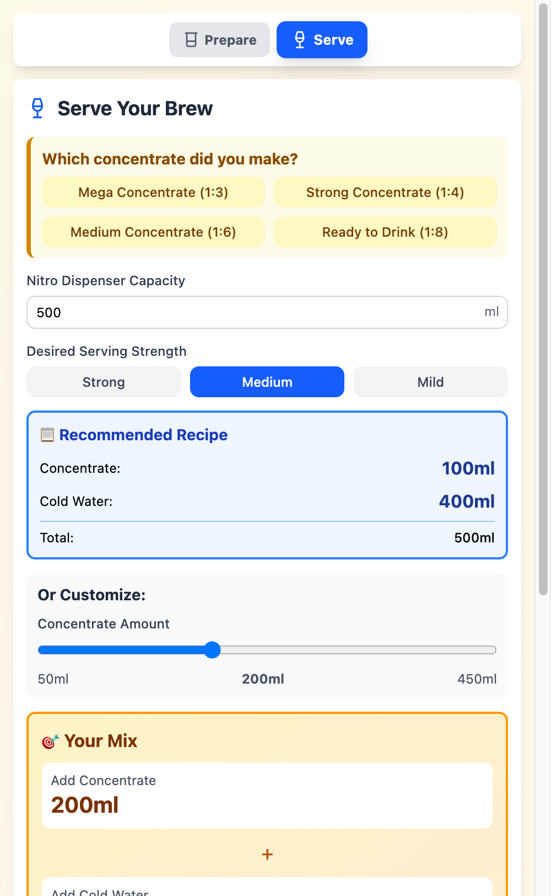

# Cold Brew Calculator

A professional cold brew concentrate calculator with serving dilution guide. Perfect your nitro cold brew ratios every time.

**Live App:** https://cold-brew-calculator.netlify.app

<div align="center">
  
  
</div>

## Features

**Step 1: Prepare Your Concentrate**
- Smart Ratio Calculator - Control by coffee amount or water amount
- Strength Presets - Mega Concentrate (1:3), Strong (1:4), Medium (1:6), or Ready-to-Drink (1:8)
- Roast Level Adjustments - Automatic ratio adjustments for light, medium, dark, and very dark roasts
- Brewing Instructions - Grind size, steep time, and method recommendations

**Step 2: Serve & Dilute**
- Nitro Dispenser Calculator - Calculate perfect dilution ratios for your dispenser
- Strength Control - Choose from Strong, Medium, or Mild serving strength
- Visual Recipe Cards - Clear step-by-step mixing instructions
- Customizable Ratios - Slide to adjust concentrate amount to your taste

**PWA Support**
- Install on Mobile - Save to your home screen for quick access
- Offline Support - Works without internet connection
- Mobile Optimized - Perfect for use in the cafe or at home
- Auto Updates - Always get the latest features

## Quick Start

**Online**

Visit: https://cold-brew-calculator.netlify.app

**Local Development**

```bash
# Clone the repository
git clone https://github.com/nerveband/cold-concentrate.git
cd cold-concentrate

# Install dependencies
npm install

# Start development server
npm run dev

# Build for production
npm run build

# Preview production build
npm run preview
```

## Tech Stack

- React 19 - UI framework
- Vite 7 - Build tool
- Tailwind CSS 4 - Styling
- Lucide React - Icons
- Vite PWA - Progressive Web App support

## Use Cases

- Home Brewers - Perfect your cold brew concentrate every time
- Coffee Shops - Quick ratio calculations for nitro dispensers
- Baristas - Consistent serving strength across batches
- Mobile Access - Install as PWA for easy access while brewing

## Pro Tips

1. Add concentrate first, then water to your dispenser
2. Stir gently before adding nitrogen
3. Chill concentrate for best results
4. Adjust ratios to taste and save your preferences

## Contributing

Contributions are welcome. Feel free to report bugs, suggest features, or submit pull requests.

## License

MIT License - free to use for your coffee adventures.

---

Made by [Ashraf Ali](https://ashrafali.net)

Built with [React](https://react.dev) + [Vite](https://vite.dev) + [Tailwind CSS](https://tailwindcss.com)
